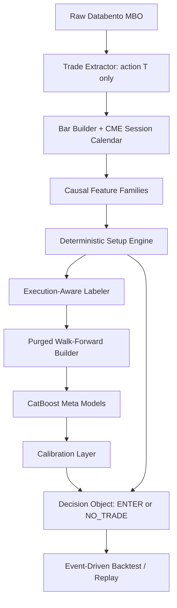

# MNQ Volume Profile AI Master Plan

Date: 2026-07-11

Scope: Phase 0 audit and implementation plan only. No production implementation
is performed by this document.

## Executive Summary

The repository is currently in a partially deleted state. Many deleted paths are
not optional junk: `modules/`, `tests/`, `tools/`, `validation/`, `labeling/`,
`setups/`, and `self_supervised/` are shown as deleted in Git. At the same time,
there is a newer MNQ-focused baseline in `features/` and `volume_profile/`, plus
a modified `prepare_day_trading.py`.

The safest rebuild path is not "restore everything" and not "delete everything".
The target should be a clean MNQ setup-validation system:

1. deterministic setup engine chooses LONG/SHORT and trade geometry;
2. CatBoost-style meta model chooses ENTER/NO_TRADE;
3. all market-direction learning from order-book depth is prohibited;
4. MBO `action == "T"` is the only executed-volume source for trade volume;
5. labels and evaluation are cost-aware, chronological, purged, and calibrated.

## Current Architecture Inventory

### Present in the working tree

| Path | Current status | Use in target |
|---|---|---|
| `prepare_day_trading.py` | Modified monolithic refinery | Keep only after tests prove no leakage or synthetic flow leakage. |
| `features/volume_profile_features.py` | Present | Reuse, but require CME session IDs instead of UTC dates. |
| `features/auction_rejection_features.py` | Present | Reuse as row-local features; multi-bar confirmations must be online. |
| `features/cvd_delta_features.py` | Present | Reuse only with explicit aggressor side or buy/sell volume. |
| `features/vwap_features.py` | Present | Reuse after CME session grouping fix. |
| `features/intraday_context_features.py` | Present | Reuse after CME session calendar fix. |
| `volume_profile/` | Present | Reuse as the first target feature library. |
| `raw/` | Present | Keep as research input, not trading evidence. |

### Deleted but required before implementation

| Path | Why it must be restored or recreated |
|---|---|
| `modules/dataset_schema.py` | Source of truth for target/leakage schema. |
| `modules/label_engine_v2.py` | Existing triple-barrier and path-label logic. |
| `modules/session_features.py` | Project authority for session handling. Must be adapted to CME sessions. |
| `modules/purging_embargo.py` and `modules/walk_forward.py` | Chronological validation safety. |
| `modules/replay_engine/` | Execution realism and cost-aware replay. |
| `modules/production/` | Guarded decision response objects. |
| `tools/diagnostics/` | Leakage, IC, label, stress, and data-quality diagnostics. |
| `tools/check_subsystem_boundaries.py` | Architecture boundary enforcement. |
| `tests/` | Regression safety. Rebuild cannot proceed without tests. |
| `validation/` | No-lookahead validation utilities. |
| `setups/` and `labeling/` | Need review: likely useful as scaffolding, but target semantics must be reset. |

### Deleted or generated paths that should not block the rebuild

| Path | Recommendation |
|---|---|
| `_archive/` | Keep deleted or move to external archive after approval. Do not restore into active tree. |
| `graphify-code-scope/`, `graphify-scope/` | Generated scope copies; keep deleted or ignore. |
| most `graphify-out/cache/**` | Generated graph cache; ignore/regenerate unless user wants persistent graph history. |
| `venv/`, `__pycache__/`, `.pytest_cache/`, `.DS_Store` | Local generated state; do not version. |

## Current Issues And Risks

1. Critical: the working tree is missing core safety code and tests.
2. Critical: prior architecture includes depth/DeepLOB components; new MNQ plan
   forbids depth-derived market direction.
3. High: several new feature modules fall back to UTC calendar dates when no
   session column is provided. This violates CME session handling.
4. High: `prepare_day_trading.py` can bootstrap bars-only inputs and synthesize
   flow-like placeholders. This is acceptable for engineering preflight, not for
   training evidence.
5. High: deleted docs include prior cleanup and leakage audits. They should be
   restored as references or recreated before changing production code.
6. Medium: `volume_profile` rolling profiles are currently row-count based. This
   is causal, but must be documented per bar size.
7. Medium: no current visible tests exist in the working tree.

## Data Readiness Assessment

The current MNQM6 file is five trading dates and roughly 179.6M rows. It is an
engineering fixture only. It can validate parsing, chunking, feature causality,
and memory behavior. It cannot validate edge, profitability, model selection, or
production readiness.

Minimum data-readiness gates:

1. MBO schema parsed with stable dtypes.
2. `action == "T"` extracted as executed trades.
3. `action == "F"` not double-counted as traded volume.
4. `side == "B"` buy aggressor, `side == "A"` sell aggressor, `side == "N"` zero
   signed volume.
5. UTC timestamps preserved; exchange-local session columns added separately.
6. partial first/last sessions flagged.
7. monotonicity, duplicates, zero/invalid prices, and abnormal gaps audited.

## Leakage-Risk Assessment

Only labels may look forward. The highest-risk areas are:

| Area | Leakage risk | Required control |
|---|---|---|
| Volume Profile | Full-session POC/VAH/VAL used intraday | Current profile must be online; full profile only shifted to next session. |
| VWAP | Full-session VWAP used before close | Use cumulative session VWAP only. |
| Auction rejection | Future re-entry confirmation | Store occurrence and confirmation time separately. |
| CVD divergence | Centered windows or future extrema | Use trailing windows only. |
| Setup labels | Outcome used to create setup features | Setup generation must run before labels. |
| Scaling | Global scaler before split | Fit on train fold only. |
| Validation | Random splits or overlapping horizons | Purged chronological walk-forward only. |

## Target Architecture

## Exact Module Boundaries

| Module family | Inputs | Outputs | Must not depend on |
|---|---|---|---|
| `data/mbo_trades` | raw MBO chunks | trades parquet | labels, models, backtests |
| `sessions` | timestamps | CME session IDs and partial-session flags | labels |
| `features/` | bars/trades up to t | causal feature matrix | future bars, labels |
| `setups/` | causal features | setup candidates and deterministic side | ML predictions |
| `labeling/` | setup candidates + future path | outcome labels | feature selection |
| `validation/` | timestamps + label horizons | purged folds | random split |
| `models/` or `modules/trading_intel/training/` | train folds | fitted meta models | test fold tuning |
| `backtesting/` or `modules/replay_engine/` | setup decisions | executed trades and costs | future-improved fills |
| `production/` | current features + artifacts | guarded decision response | live fitting |

## Dependency Graph

1. MBO trade extraction is the root.
2. CME session calendar is shared by features, labels, validation, and reports.
3. Feature contracts feed setup generation.
4. Setup candidates feed labels and meta-model rows.
5. Labels feed training only, never setup features.
6. Walk-forward folds control model selection and calibration.
7. Backtest consumes model outputs and setup geometry.

## Phased Implementation Order

### Phase 0 - Restore Safety And Plan

Restore or recreate docs, tests, schema, diagnostics, and validation scaffolding.
No trading claims.

### Phase 1 - MNQ Trade Extraction And Session Calendar

Build chunked MBO `action == "T"` extraction, signed volume, bars, and CME
session IDs.

### Phase 2 - Causal Feature Contracts

Wire Volume Profile, auction rejection, CVD/delta, VWAP, and intraday context
with leakage tests.

### Phase 3 - Deterministic Setup Engine

Generate setup candidates, side, entry, invalidation, stop, targets, max holding
time, and reason codes.

### Phase 4 - Cost-Aware Labels And Backtest

Build setup outcome labels and replay/backtest with commission, slippage,
latency, and stop slippage.

### Phase 5 - Meta Models And Calibration

Train CatBoost models with purged walk-forward and validation-only calibration.

### Phase 6 - Production Decision Object

Emit guarded ENTER/NO_TRADE responses with confidence, expected R, risk fields,
and no-trade reasons.

## Acceptance Criteria By Phase

| Phase | Acceptance criteria |
|---|---|
| 0 | Required docs exist; cleanup classification reviewed; no production code changed. |
| 1 | MBO T/F handling tested; sessions correct; partial sessions flagged. |
| 2 | Feature leakage tests pass per family; no depth-direction inputs included. |
| 3 | Setup candidates deterministic and reproducible; no ML side selection. |
| 4 | Labels account for costs and delayed entry; repeated events deduped. |
| 5 | Purged walk-forward reports calibration, PR-AUC, expectancy, drawdown. |
| 6 | Production response fails closed on missing artifacts or drift. |

## Items To Remove Or Deprecate

| Item | Action |
|---|---|
| Depth-derived directional features | Prohibit as model inputs. May remain for descriptive diagnostics only. |
| DeepLOB/SSL directional baseline | Defer from initial MNQ baseline. Do not train until CatBoost baseline exists. |
| `_archive/**` | Keep out of active imports. Delete only after approval or external backup. |
| `graphify-code-scope/`, `graphify-scope/` | Treat as generated duplicates. |
| UTC-date session grouping | Replace with CME exchange session IDs. |
| bars-only synthetic flow features in training | Disallow unless explicitly flagged as preflight-only. |

## Items That Can Be Reused Safely

| Item | Conditions |
|---|---|
| `volume_profile/` | Use CME session IDs; confirm action T executed volume source. |
| `features/volume_profile_features.py` | Keep online/current profile semantics. |
| `features/cvd_delta_features.py` | Require explicit aggressor side or buy/sell volume. |
| `features/vwap_features.py` | Use cumulative VWAP with CME session IDs. |
| `modules/dataset_schema.py` from Git | Restore and update for MNQ setup targets. |
| `modules/replay_engine/` from Git | Restore and adapt to setup geometry/costs. |
| `tools/diagnostics/*` from Git | Restore leakage, label, IC, and stress diagnostics. |

## Memory And Compute Strategy For 179M MBO Rows

1. Read MBO in chunks with pyarrow/polars/pandas chunking.
2. Column-prune to timestamp, action, side, price, size, symbol, instrument, and
   sequence for Phase 1.
3. Store trades and bars as partitioned parquet by symbol/session/date.
4. Use categorical or dictionary encoding for `action`, `side`, `symbol`.
5. Keep prices as integer ticks where possible.
6. Avoid full-file groupby in memory.
7. Create session-level manifests with row counts, invalid rows, and partial
   session flags.
8. Cache feature artifacts with schema/version sidecars.

## Stop/Go Recommendation

Stop for production implementation until Phase 0 is reviewed. Go for Phase 1
only after the user approves which deleted active files should be restored and
which generated/archive files should remain deleted.

